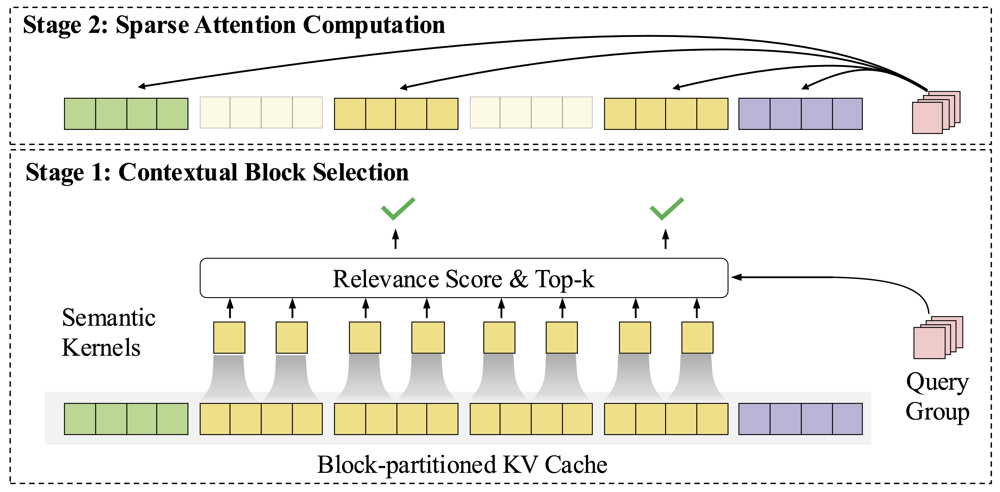

# InfLLM V2 CUDA 内核实现：两阶段稀疏注意力机制

[English](README.md) | [中文](README_zh.md)

本仓库包含了 **InfLLM V2 两阶段稀疏注意力机制** 的优化 CUDA 内核实现。我们的实现为第一阶段（Top-K 上下文选择）和第二阶段（稀疏注意力计算）都提供了高性能内核，使大型语言模型（LLM）能够通过可训练的稀疏模式高效处理长上下文。

## 概述

InfLLM V2 引入了一种新颖的两阶段方法来高效处理长上下文：
- **第一阶段：Top-K 上下文选择**：使用语义内核进行块评分和聚合（内核计算和聚合分数，选择在外部执行）
- **第二阶段：稀疏注意力计算**：对选定块进行注意力计算

这个 CUDA 内核实现包含两个阶段，提供：
- 第一阶段优化的相关性分数计算和聚合（Top-K 选择在外部执行）
- 第二阶段对选定块的高效稀疏注意力
- 显著降低前向和反向阶段的计算成本
- 与现有 Transformer 架构无缝集成

基于 [FlashAttention](https://github.com/Dao-AILab/flash-attention) 构建，我们的内核在两个阶段都利用了高效的内存访问模式和优化实现。



## 两阶段架构

### 第一阶段：Top-K 上下文选择
Top-K 选择阶段包含三个顺序步骤：
1. **相关性分数计算**：计算查询令牌与每个语义内核（键值块的压缩表示）之间的分数，然后进行 softmax 归一化
2. **分数聚合**：使用维度缩减（hdim16_reduce）在查询组维度上聚合每个语义内核的相关性分数
3. **块选择（后处理）**：基于聚合分数为每个查询令牌选择 top-K 上下文块

注意：`infllmv2_attn_stage1` 内核处理步骤 1 和 2（分数计算和聚合）。只有步骤 3（Top-K 选择）在内核外部执行。

### 第二阶段：稀疏注意力计算
稀疏注意力阶段执行标准注意力计算，但仅在第一阶段选择的块上进行：
- 支持前向和反向传递
- 通过块稀疏模式实现高效内存访问

## 内核设计特性
- **Token 级别查询，块级别键值**：避免解码时的训练-推理不一致性
- **可训练的上下文选择**：通过令牌级键向量优化间接更新语义内核
- **选择性块注意力**：仅对第一阶段选择的块执行注意力计算

## 内核实现细节

### 第一阶段内核
- `infllmv2_attn_stage1`：计算压缩查询表示与语义内核之间的相关性分数，包含 LSE 近似和维度缩减
- 执行查询组维度上的分数聚合（hdim16_reduce）
- 返回聚合的注意力分数供后续 Top-K 选择使用（选择在内核外部执行）
- 支持因果掩码和可变序列长度

### 第二阶段内核
- `infllmv2_sparse_attn_fwd`：稀疏注意力的前向传递内核
- `infllmv2_sparse_attn_bwd`：用于训练的反向传递内核

## 安装

### 系统要求

- PyTorch 1.12+
- CUDA 11.6+（需要 CUDA 开发工具包）
- Python 3.7+
- Linux 操作系统
- 足够的 GPU 内存用于内核编译
- Ninja 构建系统（用于加速编译）

### 从源码构建

#### 训练环境安装（main 分支）

```bash
# 克隆仓库并切换到 main 分支用于训练
git clone https://github.com/OpenBMB/infllm_v2_cuda.git
cd infllm_v2_cuda
git checkout main

# 安装并编译 CUDA 内核
pip install -e .

```

#### Hugging Face 推理安装（feature_infer 分支）

```bash
# 克隆仓库并切换到 feature_infer 分支用于推理
git clone https://github.com/OpenBMB/infllm_v2_cuda.git
cd infllm_v2_cuda
git checkout feature_infer

# 安装并编译 CUDA 内核
pip install -e .

```


## 使用方法

### CUDA 内核 API

InfLLM V2 CUDA 内核为两阶段稀疏注意力提供以下接口：

#### 第一阶段：注意力分数计算和聚合（feature_infer 分支）

```python
from infllm_v2 import infllmv2_attn_stage1

# 第一阶段：计算和聚合查询与语义内核之间的相关性分数
# 此内核执行：
#   1. 使用压缩键的 LSE 近似
#   2. 完整注意力分数计算
#   3. 查询组维度上的分数聚合（hdim16_reduce）
# Top-K 选择必须在聚合分数上单独执行
#
# 输入：
#   - q: 查询张量 (batch_size * n_heads, seqlen_q, head_dim)
#   - k: 表示语义内核的压缩键张量
#   - v: 占位符张量（在分数计算中不使用）
#   - cu_seqlens_q, cu_seqlens_k: 累积序列长度
#   - max_seqlen_q, max_seqlen_k: 最大序列长度

# 返回聚合的注意力分数供后续 Top-K 选择使用
aggregated_scores = infllmv2_attn_stage1(
    q, k, v,
    cu_seqlens_q=cu_seqlens_q,
    cu_seqlens_k=cu_seqlens_k,
    max_seqlen_q=max_seqlen_q,
    max_seqlen_k=max_seqlen_k,
    causal=True,  # 应用因果掩码
    return_attn_probs=True  # 返回注意力分数
)

# Top-K 选择应该在返回的聚合分数上执行
# （此步骤不是内核的一部分）
```

#### 第二阶段：稀疏注意力计算

```python
from infllm_v2 import infllmv2_sparse_attn_func

# 第二阶段：稀疏注意力计算内核
# 输入：
#   - q_unpad: 查询张量（token 级别）
#   - k_unpad, v_unpad: 键和值张量（块级别）
#   - cu_seqlens_q, cu_seqlens_k: 累积序列长度
#   - topk_idx: 第一阶段选择的块索引
#   - max_seqlen_q, max_seqlen_k: 最大序列长度
#   - block_window_size: 可选的局部注意力窗口大小

out_unpad = infllmv2_sparse_attn_func(
    q_unpad, k_unpad, v_unpad,
    cu_seqlens_q, cu_seqlens_k,
    topk_idx,  # 第一阶段选择的块索引
    max_seqlen_q, max_seqlen_k,
    block_window_size = 0,  # 额外的局部注意力窗口
)
```

### 内核参数

#### 第一阶段参数
- **q**：查询张量，形状为 (batch_size * n_heads, seqlen_q, head_dim)
- **k**：表示语义内核的压缩键张量
- **causal**：是否应用因果掩码
- **return_attn_probs**：是否返回注意力分数（Top-K 选择所需）
- **输出**：聚合的注意力分数矩阵（沿查询组维度缩减）供外部 Top-K 选择使用

#### 第二阶段参数
- **q_unpad**：未填充格式的查询张量（bfloat16）
- **k_unpad, v_unpad**：未填充格式的键和值张量
- **topk_idx**：包含第一阶段选择的块索引的整数张量
- **block_window_size**：局部注意力窗口大小（0 表示禁用）

### 设计原则

#### 复杂度分析
- **第一阶段**：O(l²) 复杂度，但通过语义内核压缩降低了常数因子
- **第二阶段**：通过稀疏注意力实现长序列的 O(l) 复杂度
- 总体计算量减少约 1/s，其中 s 是语义内核大小

#### 超参数推荐
基于算法效果和硬件约束：
- **语义内核大小**：32（平衡精度和效率）
- **步长**：16（50% 重叠以获得更好的覆盖）
- **查询组大小**：最少 16 个头（为了高效利用 GPU 张量核心）

### 性能考虑

- 内核自动处理不同的 GPU 架构（SM80/SM90）
- 针对变长序列的批处理进行了优化
- 通过未填充张量格式和块稀疏模式实现内存高效
- 两个阶段都支持 bfloat16 精度

## 支持的 GPU 架构

- **SM 80**: A100
- **SM 90**: H100

## 性能基准测试

### 性能对比：InfLLMv2 vs FlashAttention

所有基准测试均采用以下配置：
- **GPU**：NVIDIA H100
- **头维度**：128
- **头数量**：2
- **查询头数**：32
- **块大小**：64
- **选择的块数**：64
- **注意力类型**：因果注意力

#### 详细性能结果

| 序列长度 | 批大小 | 实现方式 | 前向 (ms) | 反向 (ms) | 总计 (ms) | 相比 FlashAttention 的加速比 |
|----------|--------|----------|-----------|-----------|-----------|------------------------------|
| 32,768 | 8 | Flash Attention | 201.46 | 526.62 | 728.08 | 1x |
| 32,768 | 8 | Triton NSA | 169.11 | 343.82 | 512.93 | 1.42x |
| 32,768 | 8 | InfLLMv2 | 133.60 | 330.04 | 463.64 | 1.57x |
| 65,536 | 4 | Flash Attention | 409.29 | 1037.46 | 1446.75 | 1x |
| 65,536 | 4 | Triton NSA | 181.88 | 469.00 | 650.88 | 2.22x |
| 65,536 | 4 | InfLLMv2 | 142.31 | 381.55 | 523.86 | 2.76x |
| 131,072 | 2 | Flash Attention | 831.77 | 2063.11 | 2894.88 | 1x |
| 131,072 | 2 | Triton NSA | 216.10 | 589.66 | 805.76 | 3.59x |
| 131,072 | 2 | InfLLMv2 | 158.42 | 468.90 | 627.32 | 4.61x |

#### 性能总结（总时间）

```
序列长度        批大小    FlashAttention    InfLLMv2    加速比
32,768          8         728.08 ms         463.64 ms   1.57x
65,536          4         1446.75 ms        523.86 ms   2.76x
131,072         2         2894.88 ms        627.32 ms   4.61x
```

## 引用

如果您在研究中使用了 InfLLM V2 CUDA 内核，请引用：

```bibtex
@article{minicpm4,
  title={MiniCPM4: Ultra-Efficient LLMs on End Devices},
  author={MiniCPM},
  year={2025}
}
```

## 致谢
- [MiniCPM4](https://github.com/OpenBMB/MiniCPM)：模型集成和测试
- [FlashAttention](https://github.com/Dao-AILab/flash-attention)：我们构建的基础 CUDA 内核架构
- [Block Sparse Attention](https://github.com/mit-han-lab/Block-Sparse-Attention)：块稀疏内核设计的灵感来源

## 许可证

* 本仓库中代码依照 [Apache-2.0](https://github.com/OpenBMB/MiniCPM/blob/main/LICENSE) 协议开源